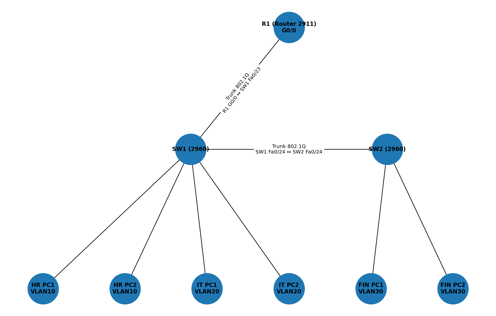

# Small Office Network — VLANs, Trunking, Router-on-a-Stick, DHCP

## Summary
A small-office network lab demonstrating VLAN segmentation (HR, IT, Finance), 802.1Q trunks, router-on-a-stick inter-VLAN routing, and centralized DHCP, demonstrating L2/L3 fundamentals and simple network automation using Python.

## 🔗 Topology

## 🌐 DHCP Demo 

## ⚙️ Automation Demo

## What you’ll find
- `topology/office_vlan_topology.pkt` — Packet Tracer file (open in Cisco Packet Tracer).
- `configs/` — Ready-to-paste device configurations (R1, SW1, SW2).
- `verification/` — Output from `show ip interface brief`, `show vlan brief`, `show ip dhcp binding`, etc.
- `automation/push_configs_netmiko.py` — Python Netmiko script to push configs (requires real devices or virtual lab reachable over SSH).

## Key commands (verification)
- Router: `show ip interface brief`, `show ip dhcp binding`, `show ip arp`
- Switches: `show vlan brief`, `show interfaces trunk`, `show mac address-table dynamic`
- PCs: Desktop → IP Configuration (DHCP) and `ping <gateway>` / `ping <other-host>`

## How to reproduce locally
1. Open `topology/office_vlan_topology.pkt` in Packet Tracer.
2. Paste configs from `configs/` into respective devices (Router → SW1 → SW2).
3. On each PC: Desktop → IP Configuration → DHCP.
4. Verify with the commands above.

## Notes on automation
Netmiko script is provided as an example. Packet Tracer devices are not reachable via SSH — the script is intended for:
- a physical lab, or
- a virtual lab (GNS3/EVE-NG/CML) with SSH-enabled images.

## Skills demonstrated
VLANs, trunking (802.1Q), inter-VLAN routing (router-on-a-stick), DHCP, basic network automation with Python.

