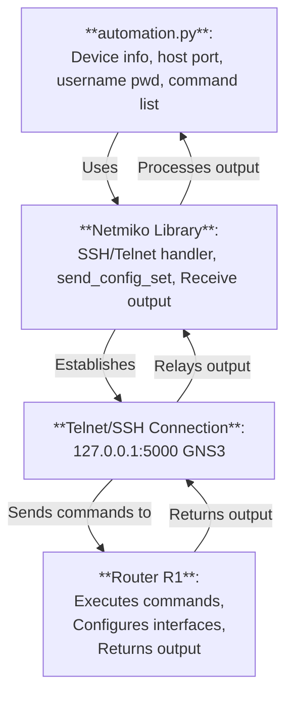
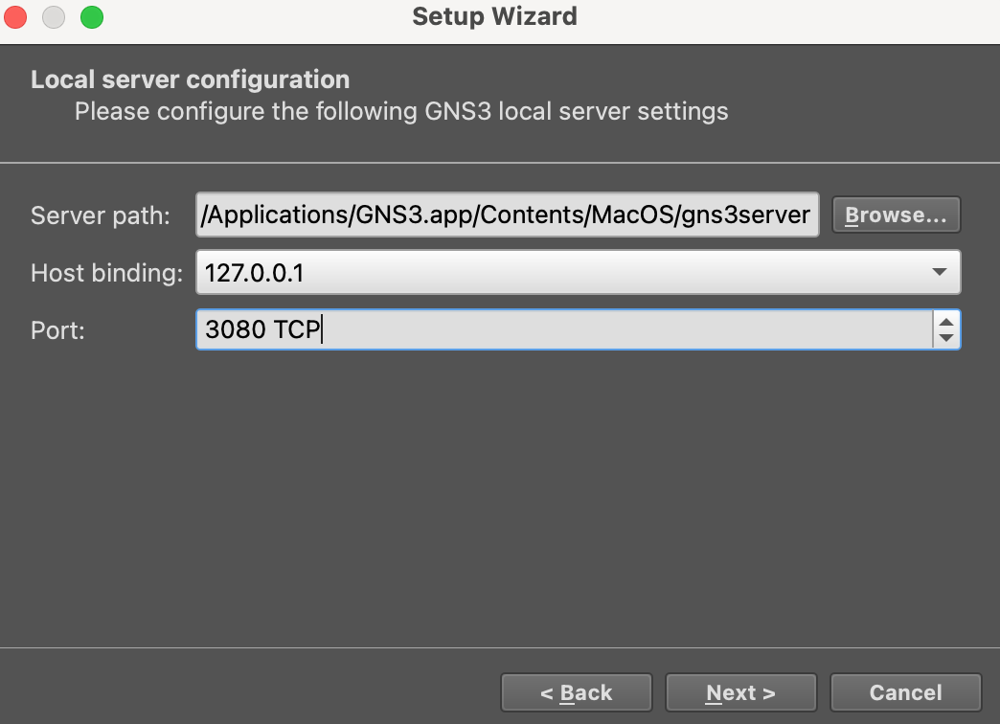
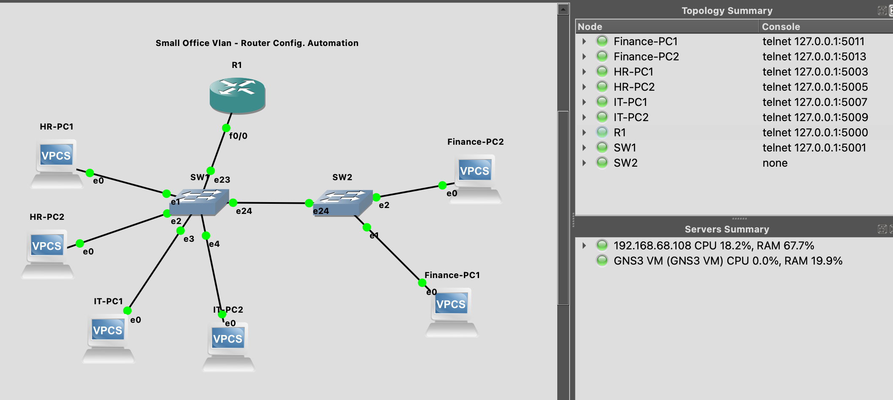

## Networking Automation
Manually populate configs of networking devices are repetitive jobs that can be carried out by running automation scripts. Network engineers can moderate configs from a YAML file and push them automatically to a huge amount of devices in no time.

## Download GNS3 VM Simulator
Register an GNS3 account to download from
```python
https://www.gns3.com/
```
This automation sim is a data pipeline of:
```python
 automation.py <-> netmiko library <-> Telnet/SSH connection <-> Router R1
```

## Setup GNS3 VM


## Configure topology and run simulation


## Run automation codes
