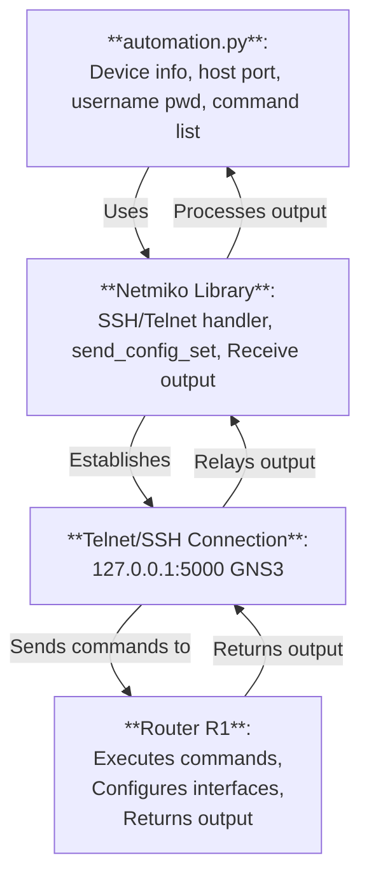

## Download GNS3 VM Simulator
Register an GNS3 account to download
```python
https://www.gns3.com/
```
This automation sim is a data pipeline of:
```python
 automation.py <-> netmiko library <-> Telnet/SSH connection <-> Router R1
```


