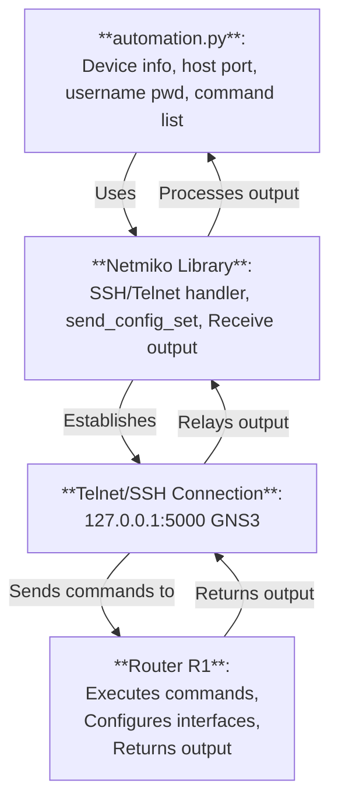

# Networking Automation
Outside of Cisco Packet Tracer, manually populating configs of networking devices are repetitive chores that can be carried out by running automation scripts. Network engineers can moderate configs from a YAML file and push them automatically to a huge amount of devices in no time.

## Download GNS3 VM Simulator
Register an GNS3 account to download from
```python
https://www.gns3.com/
```
This automation sim is a data pipeline of:
```python
 automation.py <-> Netmiko Library <-> Telnet/SSH connection <-> Router R1
```

## Setup GNS3 VM
When prompted to download a virtual machine (VM) in GNS3, follow insturctions to run the GNS3 in a Virtual Environment. Then setup the ports and bind the hosts to a localhost IP like 127.0.0.1, which will become the telnet (IP) address of SSH-enabled network devices in the simulation


## Configure topology and run simulation
The switches used are not SSH-enabled, hence only routers can interact with the automation data pipeline. Router image used is Cisco 3725, which is imported from online sources.


## Run automation codes
Map the telnet address of router R1 in `inventory.yaml`. Via a terminal, run the automation.py script
```python
python3 automation.py
```
